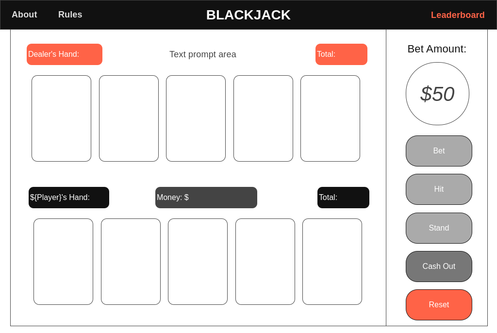
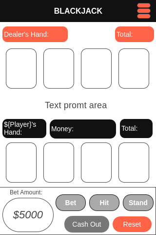

# Developing a Card Game: Blackjack

## Project Brief
**MVP - Minimum Viable Product**
- Built with HTML, CSS & JavaScript
- Utilizing JS for DOM manipulation
- Hosting via GitHub page (& frequent commits)
- A README.md that will detail tech used, how-to-play guide, game model, project timeframes, approaches, issues, and more.
- To be displayed in browser
- Have user interaction via clicks/taps
- Game selected must have a win-lose condition

## Timeline
2 Weeks

## Tech & Tools Utilized
- HTML
- CSS
- JavaScript
- Git + GitHub

## Description

###### Origins

Blackjack, also known as 21, is a classic card game that has its roots in the casinos of France in the 1700s, where it was originally called "Vingt-et-Un" (French for twenty-one). The game made its way to America in the 18th century, where it became an instant favorite in illegal gambling dens. It wasn't until Nevada legalized gambling in 1931 that Blackjack found a legitimate and permanent home in casinos.

###### Gameplay

The objective of Blackjack is simple: to beat the dealer's hand without going over 21. Each player starts with two cards, one of the dealer’s cards is hidden until the end of the round. Players can choose to receive additional cards (hit) or stick with their current total (stand). The key decisions in Blackjack involve when to hit, stand, and sometimes surrender. 

###### Betting and Winning

At its core, Blackjack is a betting game. Each player places a bet before the cards are dealt. If a player's card total is closer to 21 than the dealer's without going over, they win double their bet. If they get a natural Blackjack (an ace and a 10-value card as the initial two cards), they usually receive a payout of 3 to 2 (1.5x their original bet). If the dealer busts and the player does not, the player wins. Bets are lost when the player busts or has a lower total than the dealer at the end of the round.

###### Conclusion

Blackjack continues to be a staple in both online and land-based casinos due to its strategic gameplay and the appeal of being able to beat the house with skill rather than pure luck. Whether you are a casual player or a serious strategist, Blackjack offers a thrilling casino experience for all appropriate ages.

## Wireframe

[Link](https://wireframe.cc/pro/pp/e934692fd853844)

 

## Deployment

The game will be deployed on GitHub pages, and the link will be provided in this section once launched.

 

## How To Play Classic Blackjack: A Guide for Players

###### Objective

The goal of Blackjack is to beat the dealer's hand without going over 21. Players aim to have a hand total that is higher than the dealer’s without busting (exceeding 21).

###### Starting the Game

1. Joining the Game: 
- Up to 7 players, including the dealer, can participate.
- The dealer is controlled by the game.
2. Initial Setup:
- Each player starts with $5000. 
- Before any cards are dealt, players will input their names and place their initial bets.
- The minimum bet amount is $50, but players can choose to bet any amount up to all their current money ("All-In")

###### Gameplay

1. Dealing Cards:
- Each player, except the dealer, receives two cards face up.
- The dealer receives one card face up and one card face down.
2. Player Decisions:
- Hit: Players can choose to take additional cards one at a time to get closer to 21.
- Stand: Players can choose to stop taking additional cards if they are satisfied with their current total or wish to avoid busting.
- All-In: At any betting opportunity, players can bet all their current money.
3. Dealer's Play: 
- After all players have made their decisions, the dealer reveals the hidden card and must hit if the total is 16 or less and stand on totals of 17 or more.

###### Betting Rules

1. Winning and Losing Bets:
- If the dealer busts, all remaining players win and are paid out equal to their bet.
- If a player busts, they lose their bet.
- If the dealer does not bust, players with a total higher than the dealer's win an amount equal to their bet. 
- Players with a total lower than the dealer's lose their bet.
2. Special Payouts
- Blackjack: If a player has a Blackjack (an Ace and a 10-value card) as their initial hand, they are paid at 3 to 2 (1.5x of original bet).
- Dealer Blackjack: If the dealer has a Blackjack, the dealer automatically wins, and players lose 1.5 times their bet.
3. Standoff: If a player and the dealer have the same total, the bet is returned to the player without adjustment.

###### Ending the Game

1. Cashing Out
- Players can choose to 'cash out' their total money to the leaderboard at any point if they decide to stop playing.
- This action records their name and total money on the leaderboard.
2. Resetting the Game
- Players can press the reset button to start a new game with initial settings. *Leaderboard remains unaffected, preserving the top 10 scores*

###### Leaderboard

- The top 10 player scores are displayed on the leaderboard.
- Names and scores are cached indefinitely, unless displaced by higher scores.

 

## Development

#### Initial Timeline

- [x] **Step 1**: Generate Standard 52 Card Deck and Game Setup (JS)
1. Develop the functionality to create and shuffle a 52-card deck. (JS)
2. Initialize player settings (money, name input) and set up betting parameters. (JS)
* [Step 1 Timeline: 2 days]

- [x] **Step 2**: Develop User Interface
1. Design and implement the main game interface. (HTML, CSS)
2. Create buttons and displays for player actions, bets, and card handling. (HTML, CSS)
* [Step 2 Timeline: 2 days]

- [x] **Step 3**: Implement Betting Mechanics and Gameplay Mechanics
1. Code the betting functions (including placing and adjusting bets). (JS)
2. Implement 'Hit', 'Stand', and basic dealer gameplay logic. (JS)
* [Step 3 Timeline: 2 days]

- [x] **Step 4**: Integrate Betting Rules and Leaderboard Development
1. Incorporate all special betting rules and payouts into the game logic. (JS)
2. Develop the leaderboard to track and display top scores. (JS, HTML, CSS)
* [Step 4 Timeline: 2 days]

- [ ] **Step 5**: Testing & Debugging (Initial Phase)
1. Conduct initial testing to identify major bugs and gameplay issues. (JS, HTML)
2. Start fixing critical bugs as they are identified. (JS, HTML)
* [Step 5 Timeline: 2 days]

- [ ] **Step 6**: Continued Testing, Debugging, and Optimization
1. Continue detailed testing across all game functions. (JS, HTML)
2. Optimize performance and enhance UI (only if ahead of schedule) (HTML, CSS)
3. Finalize leaderboard integration and ensure it functions across sessions.

- [ ] **Step 7**: Final Review & Launch Preparation
1. Conduct final playtests, possibly with external testers.
2. Make last-minute adjustments based on feedback.
3. Prepare and execute game launch.

 

## Key Learnings

## Summary

<!-- Internal Dev Notes -->